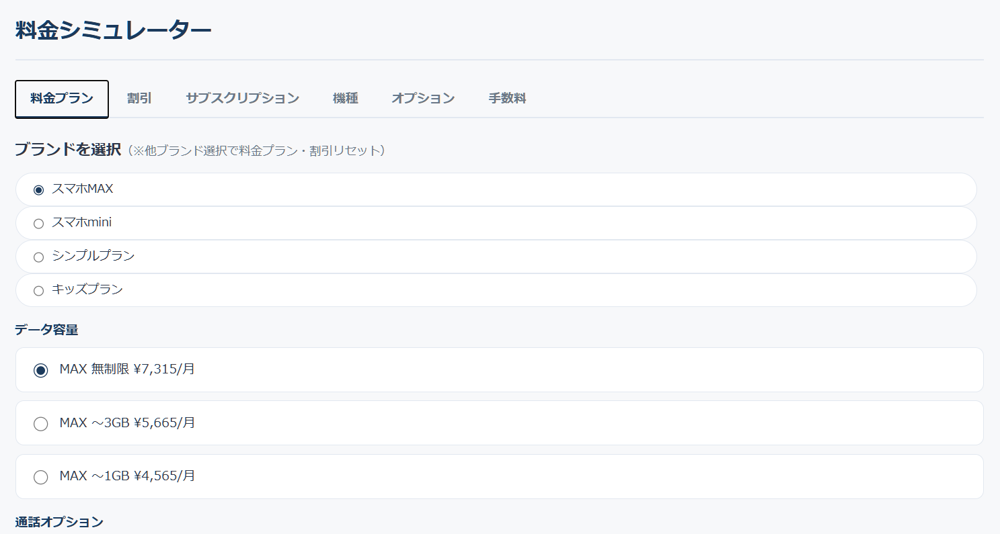
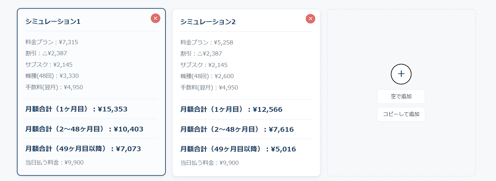
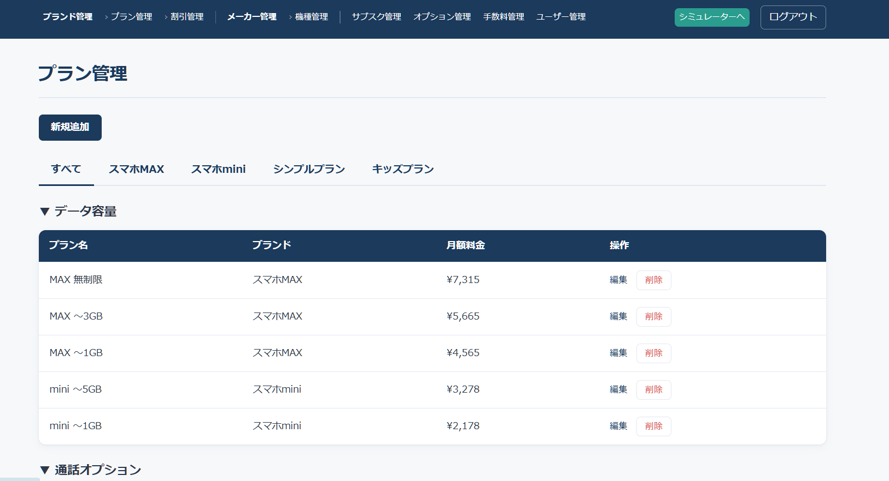
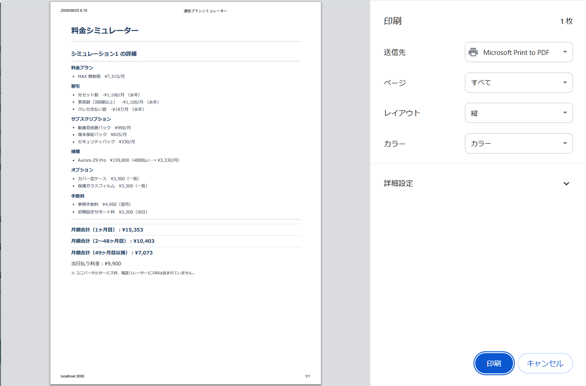
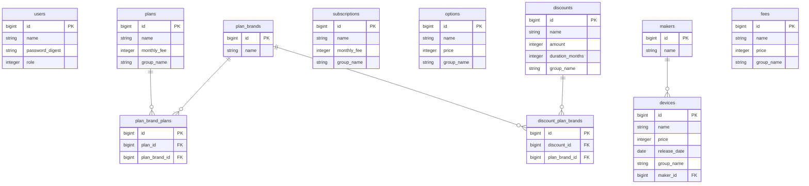

# 通信プラン料金シミュレーター（plan_simulator）

携帯ショップの店頭スタッフが、顧客への料金案内をスムーズに行うための**料金シミュレーションツール**です。
複数の料金プラン・割引・サブスク・オプション・手数料・機種を組み合わせて月額料金を即座に計算し、最大3パターンを並べて比較できます。

> 携帯ショップでの販売・接客経験から、「複雑な料金プランを正確かつ素早く案内したい」という現場の課題を解決するために制作しました。

---

## 📌 デモ / 動作確認

- **デプロイURL**: （デプロイ後に記載）
- **ゲストログイン**: ログイン画面の「ゲストログイン」ボタンから、登録不要で全機能をお試しいただけます。

> ※ 社内ツールを想定しているため新規登録機能は設けず、初期管理者を起点に管理者がスタッフアカウントを発行する設計です。閲覧者はゲストログインで管理者権限の全機能を体験できます。

---

## 🖼 スクリーンショット

| シミュレーター画面 | 比較・詳細 |
| :---: | :---: |
|  |  |

| 管理画面（一覧） | 印刷プレビュー |
| :---: | :---: |
|  |  |

---

## ✨ 主な機能

### シミュレーター（メイン機能）
- **動的な料金計算**: プラン・割引・サブスク・オプション・手数料・機種を選ぶと、月額料金と当日支払額をリアルタイムに自動計算
- **グループ単位の選択制御**: 料金プランや割引はグループごとに排他選択（いずれか1つ）、サブスク・オプション・手数料は複数選択に対応
- **時間経過に応じた段階表示**: 期間限定割引の終了や、機種・オプション・手数料の分割払いの完了を考慮し、「1〜12ヶ月目」「13〜24ヶ月目」「25ヶ月目以降」のように、料金が変わる節目ごとに月額を段階表示
- **分割払い計算**: 機種・オプションを一括／12・24・36・48回払いで切り替え、月額・当日払いに自動振り分けができ、手数料は当日・翌月のどちらかを選択可能
- **複数プラン比較**: 最大3パターンを横並びで比較。空から追加・既存をコピーして追加・個別削除が可能
- **詳細表示と印刷**: 選択内容の詳細を表示し、印刷用に整形して出力（顧客への提示用）

### 管理機能（管理者のみ）
- 料金プラン・割引・ブランド・サブスク・オプション・手数料・メーカー・機種・ユーザーの**CRUD**
- 各マスタの**グループ分け表示**、ブランド／メーカーによる**タブ絞り込み**
- 権限・登録日順でのユーザー一覧表示

### 認証・認可
- `has_secure_password` によるログイン認証
- 一般／管理者の権限管理（enum）と、管理画面へのアクセス制御
- ゲストログイン機能

---

## 🛠 使用技術

| 分類 | 技術 |
| --- | --- |
| 言語 | Ruby 3.3.3 / JavaScript |
| フレームワーク | Ruby on Rails 7.2.3 |
| データベース | PostgreSQL 18.4 |
| フロントエンド | HTML / CSS（独自実装）/ Vanilla JavaScript |
| 認証 | bcrypt（has_secure_password） |
| インフラ | Render |
| バージョン管理 | Git / GitHub |

> JavaScriptはフレームワークを使わず、状態管理・DOM描画・料金計算を素のJavaScriptで実装しています。

---

## 🗄 ER図



| リレーション | 種類 | 説明 |
| --- | --- | --- |
| plans ⇔ plan_brands | 多対多 | `plan_brand_plans` を介し、1つのプランを複数ブランドで共有 |
| discounts ⇔ plan_brands | 多対多 | `discount_plan_brands` を介し、割引の対象ブランドを管理 |
| makers → devices | 1対多 | 1つのメーカーが複数の機種を持つ |

---

## 💡 実装上の工夫

### 状態とUIの分離（シミュレーター設計）
シミュレーターでは、ユーザーの選択内容をJavaScriptの「状態オブジェクト」として一元管理し、画面表示と切り離す設計にしました。これにより、タブの切り替えや最大3件の比較を行っても各シミュレーションの選択が保持されます。

### 時間軸を考慮した料金計算
「特定の月における月額」を求める関数を用意し、割引の終了月・機種やオプション、手数料の分割完了月をすべて「料金が変わる節目」として収集することで、時間経過に応じた料金推移を正確に段階表示しています。

### 柔軟なグループ分類へのリファクタリング
当初は料金プランを固定カテゴリ（データ/音声/キッズ）で分類していましたが、運用で分類を自由に変更できるよう、`group_name` による可変グループ方式へリファクタリングしました。これにより全マスタで統一的なグループ分けを実現しています。

### Fat Model, Skinny Controller
並び替えや絞り込みのロジックを `scope` としてモデルに集約し、コントローラーを簡潔に保っています。

### パフォーマンス・セキュリティ
- 一覧取得時に `includes` を用いて関連データを先読みし、N+1問題を回避
- ストロングパラメーターによるマスアサインメント対策、権限に応じたアクセス制御を実装

---

## 🚀 ローカル環境での起動

```bash
# リポジトリをクローン
git clone https://github.com/kazkaz9717/plan_simulator.git
cd plan_simulator

# 依存パッケージをインストール
bundle install

# データベースを作成・初期化
rails db:create
rails db:migrate
rails db:seed

# サーバーを起動
rails server
```

ブラウザで `http://localhost:3000` にアクセスし、ゲストログインからお試しください。

---

## 👤 制作者

- GitHub: [kazkaz9717](https://github.com/kazkaz9717)
- 携帯ショップでの販売・接客職からWebエンジニアへの転職を目指して制作しました。現場で感じた「複雑な料金案内を効率化したい」という課題を、自らの手で形にすることを目指しています。
